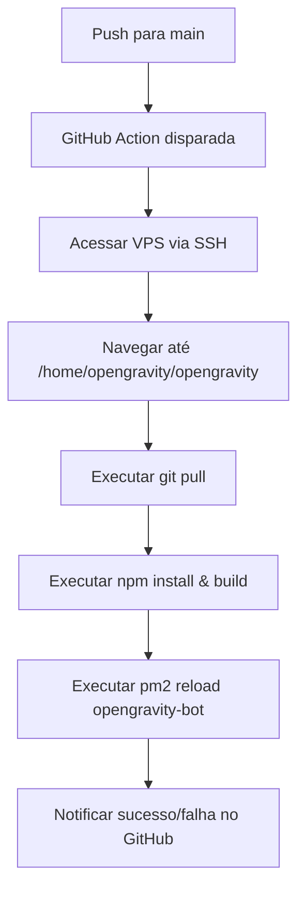

# Design: Deploy Automático (CI/CD) via GitHub Actions

Este documento descreve a arquitetura e o fluxo de trabalho para automatizar o deploy do OpenGravity na VPS sempre que houver um push na branch `main`.

## Objetivos
- Automatizar o processo de `git pull`, `npm install`, `build` e reinicialização do bot.
- Garantir a segurança utilizando chaves SSH e usuários limitados.
- Fornecer visibilidade do status do deploy diretamente no GitHub.

## Arquitetura

O fluxo utiliza **GitHub Actions** como orquestrador e **SSH** como protocolo de comunicação segura com a VPS.

### Componentes
1.  **GitHub Workflow:** Um arquivo YAML (`.github/workflows/deploy.yml`) que define os passos do deploy.
2.  **GitHub Secrets:** Armazenamento seguro de variáveis sensíveis (`SSH_PRIVATE_KEY`, `VPS_HOST`, `VPS_USER`).
3.  **SSH Deploy Key:** Uma chave SSH exclusiva para que a VPS possa autenticar no repositório privado.
4.  **PM2:** Gerenciador de processos na VPS que será reiniciado pelo workflow.

## Fluxo de Trabalho (Workflow)

## Considerações de Segurança
- **Usuário de Serviço:** O deploy será feito sob o usuário `opengravity`, nunca como `root`.
- **Escopo Limitado:** A chave SSH terá permissões específicas para o projeto.
- **Secrets:** Nenhuma informação sensível (IP, chaves, senhas) ficará exposta no código.

## Plano de Backup/Rollback
- Em caso de falha no build, o PM2 manterá a versão anterior rodando (usando `pm2 reload`).
- Logs do GitHub Actions permitirão identificar erros rapidamente.
